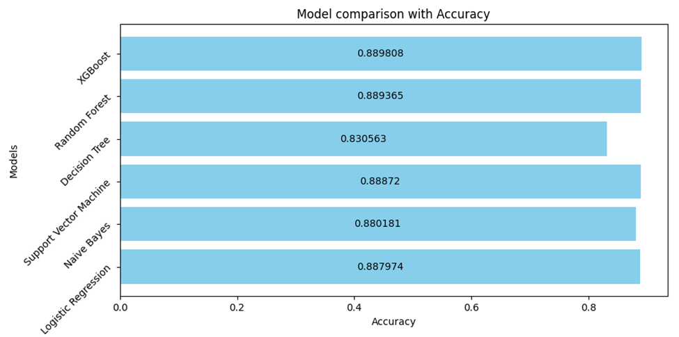
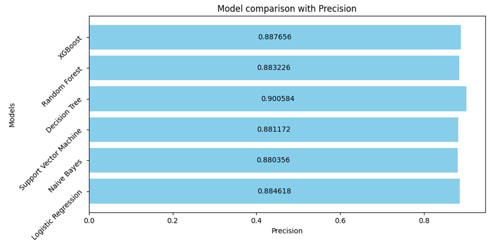
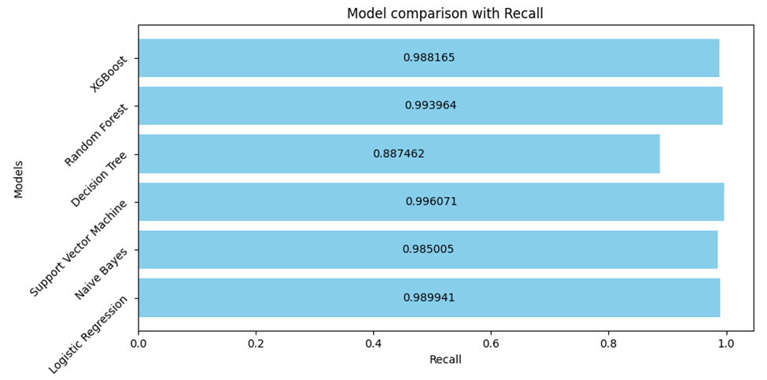
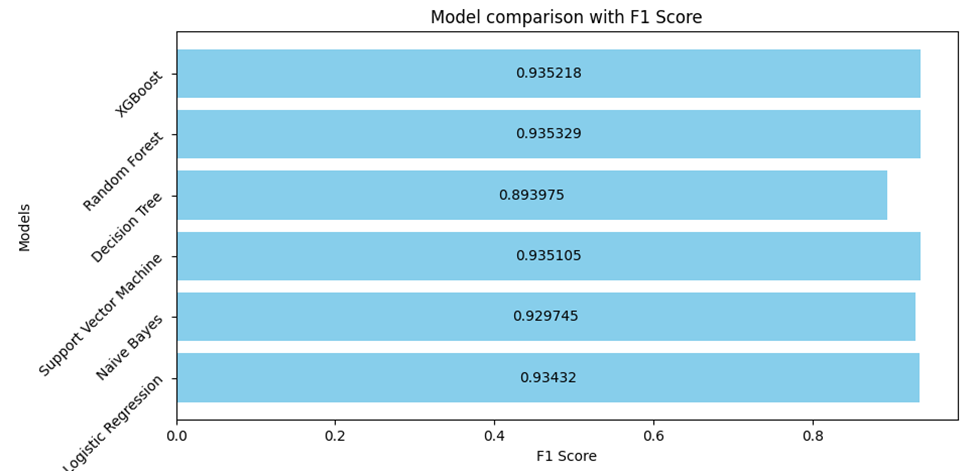
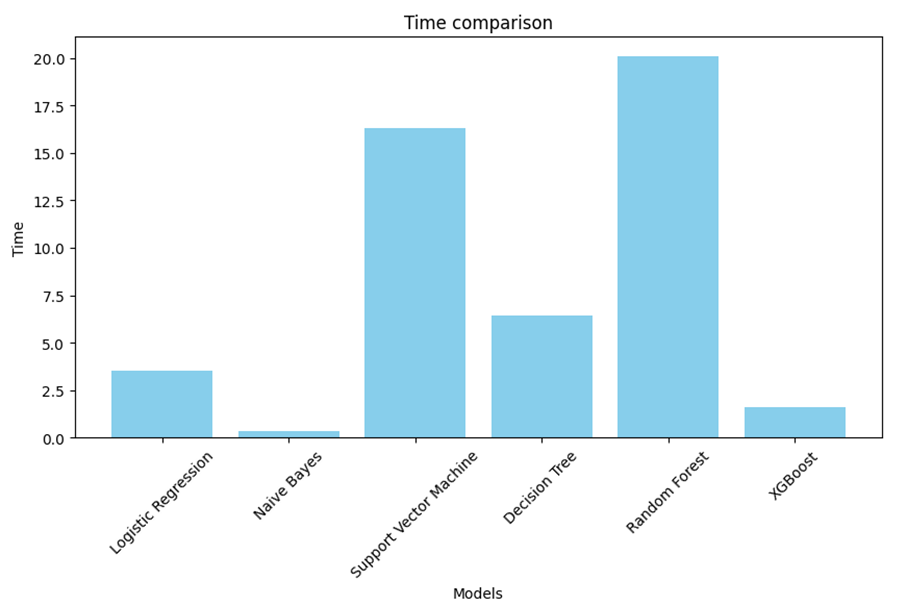
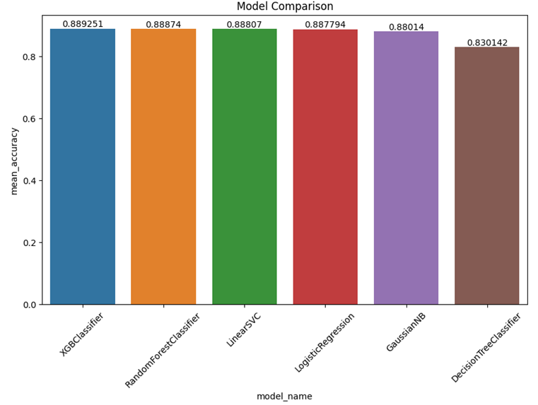
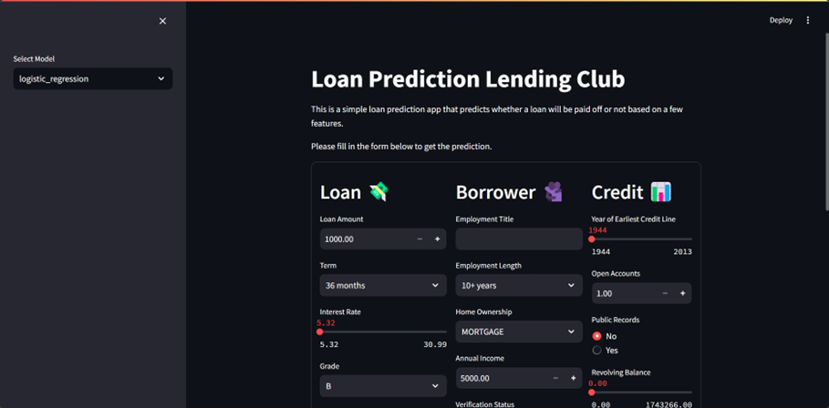
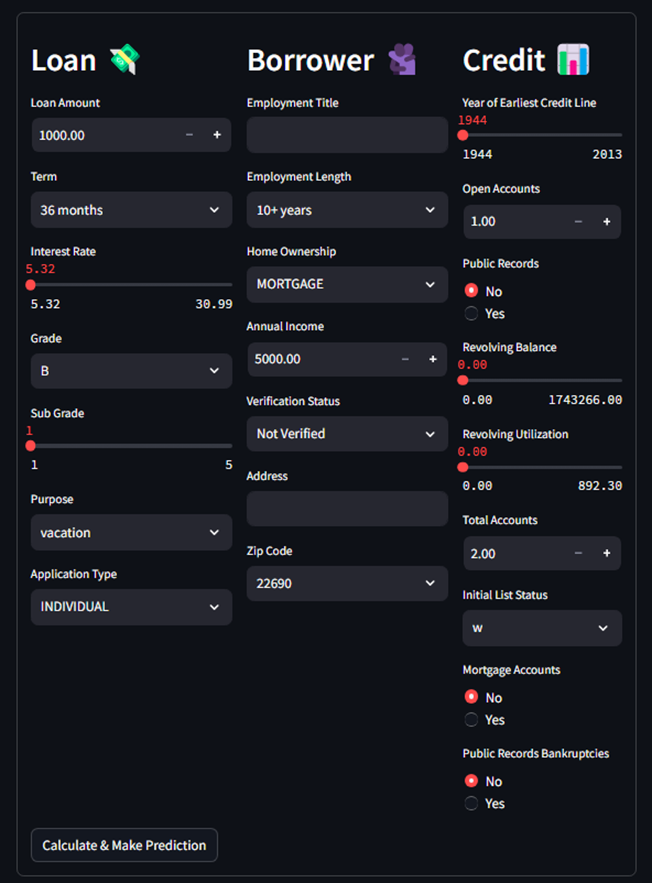
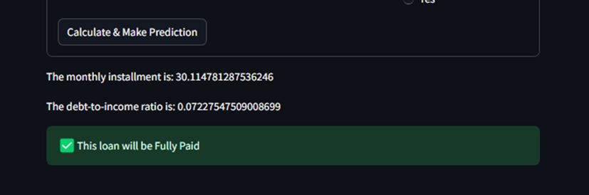

<div align="center">
  <div id="user-content-toc">
    <ul>
      <summary><h1 style="display: inline-block;">💸 P2P Credit Risk Analysis 📊</h1></summary>
    </ul>
  </div>
  <p>P2P CREDIT RISK ANALYSIS ON LENDING CLUB PLATFORM USING MACHINE LEARNING CLASSIFICATION ALGORITHMS</p>
</div>
  

## 📝 Table of Contents
1. [Introduction](#introduction)
2. [Project Overview](#project-overview)
    - [Methodology](#methodology)
    - [About Dataset](#about-dataset)
3. [Models](#models)
4. [Evaluation](#evaluation)
    - [Conclusions](#conclusions)
5. [Demonstration Application](#demonstration-application)
    - [Installation](#installation)
6. [Contributing](#contributing)
7. [Acknowledgments](#acknowledgments)


## 🔎 Introduction

The P2P lending industry, exemplified by platforms like Lending Club, has transformed financial services by providing alternative funding avenues. This project addresses the critical challenge of credit risk assessment using machine learning algorithms. By analyzing extensive Lending Club data, we employ models such as Logistic Regression, Decision Trees, Naive Bayes, Random Forest, Gradient Boosting (XGBoost), and Support Vector Machine to improve risk prediction accuracy. This research enhances both academic understanding and practical risk management strategies, promoting sustainable growth in P2P lending.

## 📑 Project Overview

The evolution of peer-to-peer (P2P) lending platforms like Lending Club has transformed the financial industry by connecting borrowers directly with lenders. While these platforms offer increased accessibility and efficiency, accurately assessing and managing credit risk remains a significant challenge. This project addresses credit risk analysis on the Lending Club platform using machine learning classification algorithms.

### 🛠️ Methodology

1. **Data Collection and Preprocessing**: We will preprocess the Lending Club dataset to ensure data quality, handling missing values, normalizing data, and addressing class imbalances.

2. **Feature Selection and Engineering**: Relevant variables influencing credit risk will be identified, and new features will be engineered to enhance model predictive power.

3. **Model Building, Evaluation, and Comparison**: We will employ various machine learning algorithms, including Logistic Regression, Decision Trees, Naive Bayes, Random Forest, Gradient Boosting (XGBoost), and Support Vector Machine. Models will be evaluated using metrics like accuracy, precision, recall, F1 score, and AUC-ROC.

4. **Model Interpretation and Optimization**: Key factors affecting credit risk will be identified, and models will be optimized through hyperparameter tuning.

5. **Deployment and Visualization**: The best-performing model will be deployed, and visualizations will be created to present findings, aiding stakeholders in informed decision-making.

By integrating data mining methodologies with machine learning, this project aims to enhance Lending Club's risk management capabilities, reduce loan defaults, and improve decision-making for lenders and borrowers. The comparative analysis ensures the most effective model is utilized, providing a robust framework for future risk assessment.

### 🔢 About Dataset

The dataset used in this study is sourced from the Lending Club platform and is publicly available on [Kaggle](https://www.kaggle.com/datasets/adarshsng/lending-club-loan-data-csv). It includes detailed information on loans issued between 2007 and 2019, comprising 396,030 rows and 27 columns. This dataset offers comprehensive insights into borrower profiles, loan characteristics, and loan performance.

> ### Dataset Description
| ID | Attribute            | Description                                                                                           | Type   |
|----|----------------------|-------------------------------------------------------------------------------------------------------|--------|
| 1  | loan_amnt            | The listed amount of the loan applied for by the borrower.                                            | Integer|
| 2  | term                 | The number of payments on the loan (36 or 60 months).                                                 | String |
| 3  | int_rate             | Interest rate on the loan.                                                                            | Float  |
| 4  | installment          | The monthly payment owed by the borrower if the loan originates.                                      | Float  |
| 5  | grade                | LC assigned loan grade.                                                                               | String |
| 6  | sub_grade            | LC assigned loan subgrade.                                                                            | String |
| 7  | emp_title            | The job title supplied by the borrower when applying for the loan.                                    | String |
| 8  | emp_length           | Employment length in years (0 to 10, where 0 means less than one year and 10 means ten or more years).| String |
| 9  | home_ownership       | The home ownership status (RENT, OWN, MORTGAGE, OTHER).                                               | String |
| 10 | annual_inc           | The self-reported annual income provided by the borrower.                                             | Float  |
| 11 | verification_status  | Indicates if income was verified by LC.                                                               | String |
| 12 | issue_d              | The month the loan was funded.                                                                        | Date   |
| 13 | loan_status          | Current status of the loan.                                                                           | String |
| 14 | purpose              | A category provided by the borrower for the loan request.                                             | String |
| 15 | title                | The loan title provided by the borrower.                                                              | String |
| 16 | dti                  | Debt-to-income ratio.                                                                                 | Float  |
| 17 | earliest_cr_line     | The month the borrower's earliest reported credit line was opened.                                    | Date   |
| 18 | open_acc             | The number of open credit lines in the borrower's credit file.                                        | Float  |
| 19 | pub_rec              | Number of derogatory public records.                                                                  | Float  |
| 20 | revol_bal            | Total credit revolving balance.                                                                       | Float  |
| 21 | revol_util           | Revolving line utilization rate.                                                                      | Float  |
| 22 | total_acc            | The total number of credit lines currently in the borrower's credit file.                             | Float  |
| 23 | initial_list_status  | The initial listing status of the loan (W, F).                                                        | String |
| 24 | application_type     | Indicates whether the loan is an individual or joint application.                                     | String |
| 25 | mort_acc             | Number of mortgage accounts.                                                                          | Float  |
| 26 | pub_rec_bankruptcies | Number of public record bankruptcies.                                                                 | Float  |
| 27 | address              | The address provided by the borrower in the loan application.                                         | String |

## 🤖 Models
The selection of these machine learning classification algorithms was driven by their unique strengths applicable to different aspects of the credit risk prediction problem on the Lending Club platform. Each algorithm is chosen based on its ability to handle the complexity and size of the dataset, manage imbalanced data distributions, and provide computational efficiency. By evaluating and comparing these models, we aim to identify the most influential factors affecting credit risk and enhance risk management practices. This analysis not only aids in understanding the predictive capabilities of each model but also guides the recommendation of optimized models for future credit risk prediction endeavors. The following models are implemented and evaluated in this project:

- Logistic Regression
- Decision Trees
- Naive Bayes
- Random Forest
- Gradient Boosting (XGBoost)
- Support Vector Machine

For details of models implementation and evaluation, please refer to the project documentation [here](./report.pdf) and project source code [here](./src/).

## ✅ Evaluation

The models are evaluated using various performance metrics, such as accuracy, precision, recall, F1 score, and AUC-ROC and using Baseline model comparison with cross validation. Also we will extract the feature importance of each model and visualize the top features that contribute the most to the model's performance. Some evaluation metrics that we collected can be found in these images:

<p align="center">
  
  
  
  
  
  
</p>

### Conclusions
Based on the comparative analysis, the following conclusions can be drawn:
1.	`XGBoost Classifier and Random Forest Classifier` emerged as the top-performing models. Both achieved high accuracy and balanced precision, recall, and F1-scores. XGBoost, with its shorter execution time, is highly suitable for deployment where computational efficiency is critical.
2.	`Support Vector Machine` also provided competitive results with high accuracy and recall, making it a good choice for scenarios prioritizing true positive rates. However, its longer execution time may be a consideration for large datasets.
3.	`Logistic Regression` offered decent performance across all metrics and is a viable option when model simplicity and interpretability are important.
4.	`Naive Bayes` demonstrated good performance with the shortest execution time, making it suitable for real-time applications where speed is a priority, despite its slightly lower accuracy.
5.	`Decision Tree` showed lower accuracy and was prone to overfitting, which limits its effectiveness on unseen data. However, it remains valuable for its interpretability.

> In conclusion, the **XGBoost Classifier** is recommended for deployment due to its high accuracy, robust performance across different metrics, and efficient execution time. Future work could involve further hyperparameter tuning and exploring advanced ensemble methods to enhance model performance even further.


## 🍎 Demonstration application

We created a demonstration application that allows users to input their loan information and receive a risk assessment based on the selected model. The application is built using Streamlit and it provides a user-friendly interface for users to interact with the models.

### Installation

To install the Streamlit application, you need to have Python installed on your system. You can install Streamlit using pip:

```
pip install streamlit
```

then run the following command:
```
pip install -r requirements.txt
```

Once Streamlit & requirements are installed, you can run the application by navigating to the `src` directory and executing the following command:

```
streamlit run 4_Loan-demo-application.py
```

This will start the Streamlit application and you can access it by opening your web browser and navigating to `http://localhost:8501`.

> Refer to download the [model checkpoints](https://drive.google.com/file/d/144bsifUySff2eBwL_7LvMo3LQVTL8o5Q/view?usp=drive_link) and locate the `models checkpoint` folder in the project directory.

Some User Interface Screenshots:
<p align="center">
  
  
      
</p>


## Contributing
Contributions to this project are welcome. If you find any issues or have suggestions for improvements, please open an issue or submit a pull request.

## Acknowledgments
We would like to thank our instructor and the University of Information Technology for providing the resources and support for this class project.